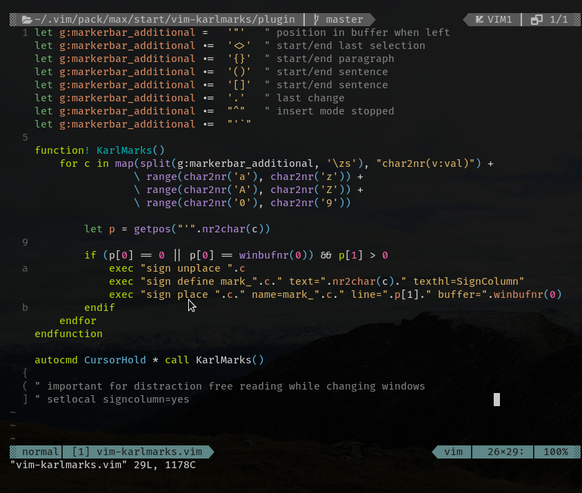

# vim-karlmarks

A teaching plugin for Vim. It uses the `signcolumn` to display currently active
`marks`. These are mostly used as jump locations and some are set by Vim
automatically during the edit sessions. Also user defined marks are shown.
These can be set with `m[a-z]`, e.g. `ma` sets mark `a` and this plugin would
display its line and you can jump to that line with ```a``. Captital letters
even allow jumps between files and session persistent marks.



Chances are that you have learned only some of the marks Vim has to offer. This
plugin will remember you to use more and once you have that on disk you can
always deinstall it again.


## Prerequirements

I recommend you use this in your `~/.vim/vimrc`

    set signcolumn=yes

because if you set it to `signcolumn=auto` it will flicker when you change
the window.

## Installation

Download the [zip file](https://git.entwicklerseite.de/vim-karlmarks/snapshot/vim-karlmarks-master.zip)
and extract it inside `~/.vim/pack/coderonline/start/`.

### Example

    mkdir ~/.vim/pack/coderonline/start/
    cd    ~/.vim/pack/coderonline/start/
    # download plugin in that directory:
    curl -o vim-karlmarks.zip  https://git.entwicklerseite.de/vim-karlmarks/snapshot/vim-karlmarks-master.zip
    # unzip the zip file
    unzip vim-karlmarks.zip
    # remove zip file (not needed any more)
    rm vim-karlmarks.zip

## Configure optional and additional marks

Here comes some inspiration for additional marks you could enable. Some
are potentially disturbing and were for that reason not pre-configured:

    let g:karlmarks  =   '"'  " position in buffer when left
    let g:karlmarks .=  '{}'  " start/end paragraph
    let g:karlmarks .=  '()'  " start/end sentence
    let g:karlmarks .=  '[]'  " start/end sentence
    let g:karlmarks .=  '.'   " last change
    let g:karlmarks .=  "^"   " insert mode stopped
    let g:karlmarks .=  "'`"

but the `g_karlmarks_additional` setting defaults to

    let g:karlmarks_additional = "<>"

to allow easier modification of the last selected block, e.g. reposition the
start of the block with `m<` and use `gv` to show the new selection.


## Deinstallation

Remove the folder `~/.vim/pack/coderonline/start/vim-karlmarks` (if you named
it as suggested in the Installation section)

### Exmaple
    rm -irv ~/.vim/pack/coderonline/start/vim-karlmarks

